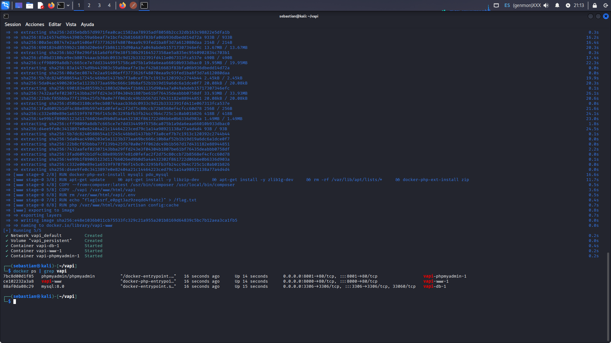
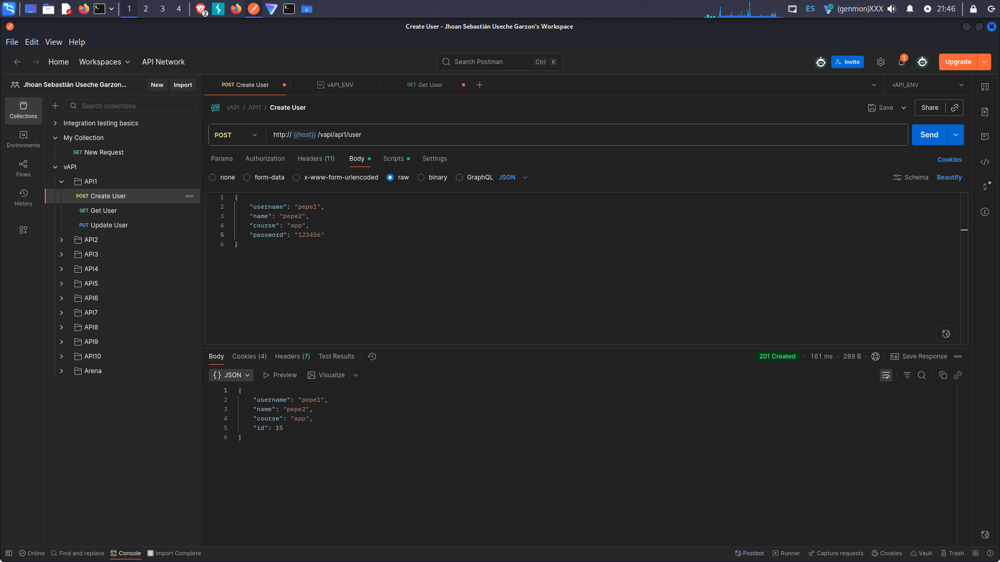
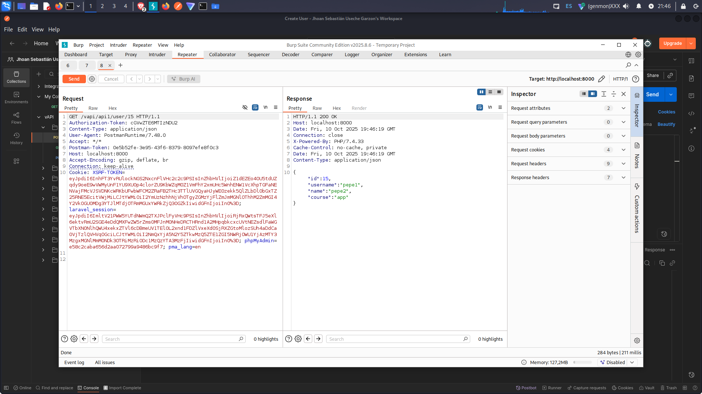
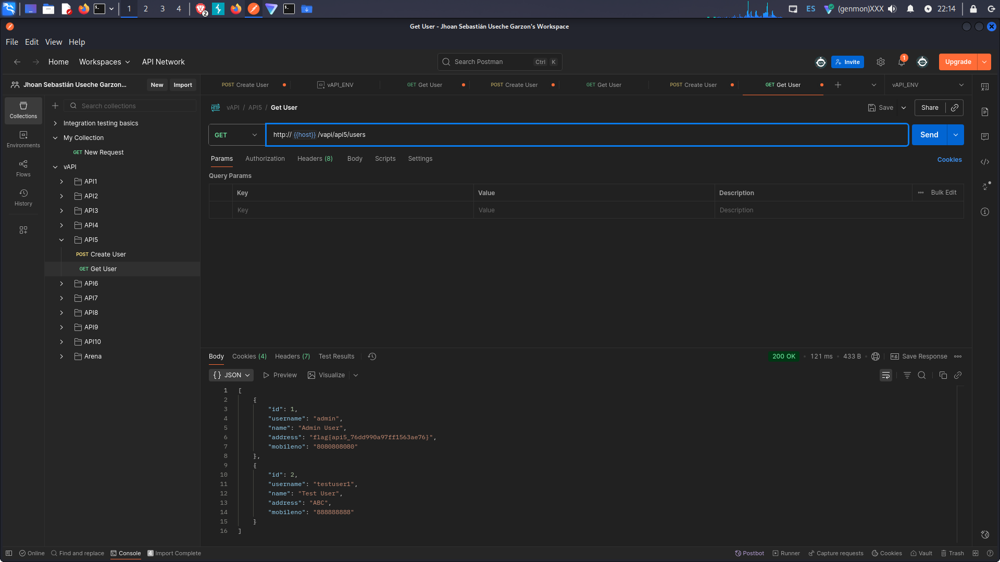
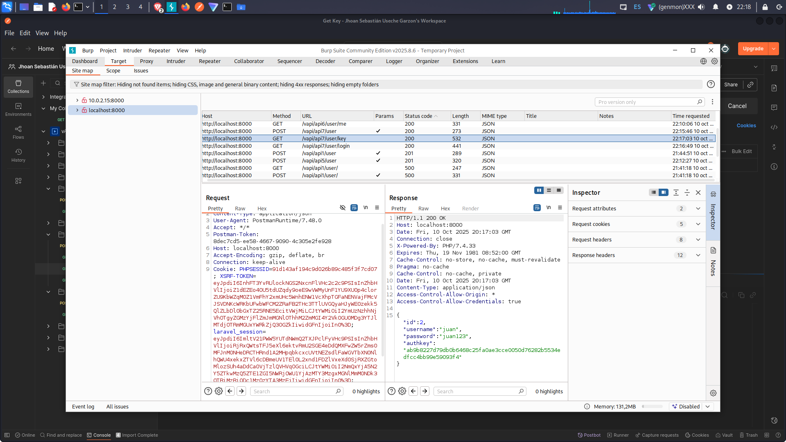
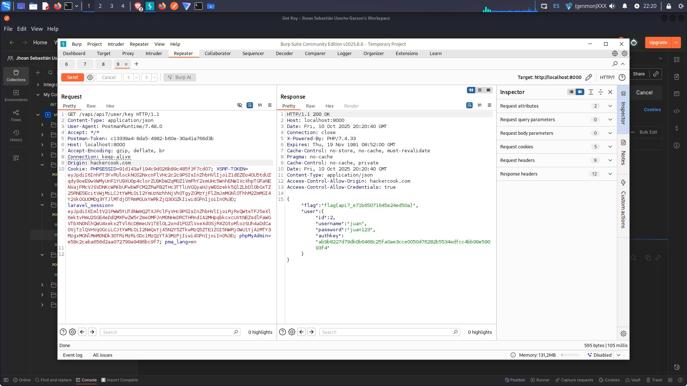

# API Security lab - OWASP Top 10 (vAPI)

## Objetivo 
Montar un entorno vulnerable (**vAPI**) para realizar pruebas de seguridad en **APIs**, explorando vulnerabilidades del **OWASP Top 10** y documentando hallazgos tecnicos con evidencias.

---
## Entorno de laboratorio
- **Sistema operativo:** Kali Linux
- **Contenedores en Docker:** 
- vapi-www - API vulnerable
- vapi-db - Base de datos MySQL 
- phpmyadmin - Administracion de base de datos
- **Herramientas Utilizadas:**
- Postman - prueba de endpoints
- Burp Suite - interceptacion y analisis de trafico HTTP 
- Docker & phpMyAdmin



---

## Instalacion 
Se desplego el entorno con: 
```bash
git clone https://github.com/roottusk/vapi.git
cd vapi
docker-compose up -d
```
# Pruebas Realizadas 

## 1. Creacion de  usuarios, IDOR (insecure Direct Object Reference) 
- Endpoint: POST /vapi/api1/user
- Descripcion: Permite crear usuarios sin restricciones 
- Hallazgo: las contraseñas se almacenan en texto plano y violacion de control de acceso


Al momento de hacer la interceptacion respectiva con Burpsuite se refleja que  modificando una id establecida por otra, Burpsuite detecta y halla otro usuario en la base de datos.

Evidencias


```bash
GET /vapi/api1/user/15 HTTP/1.1
```


```bash
GET /vapi/api1/user/1 HTTP 1.
```


---

## 2. Obtencion de usuarios sin autenticacion 
- Endpoint: GET /vapi/api5/users 
- Descripcion: devuelve el listado completo de ususarios. 
- Hallazgo: se expone datos sensibles como direcciones, telefonos, contraseñas y flags.



---

## 3. Exposicion de claves y flags

- Descripcion: varias respuestas incluyen password, authkey y flag directamente.
- Impacto: exposcion de credenciales y llaves criticas.  






----
## Vulnerabilidades Encontradas
- **Exposicion de datos sensibles** (contraseñas,API keys,flags).
- **Falta de autenticacion/autorizacion** en multiples endpoints. 
- **IDOR** (**BROKEN ACCESS CONTROL**)
- **Security Misconfiguration:** phpMyAdmin expuesto

---


## Relacion con OWASP Top 10 
- A01 - **Broken Acces Control**
- A02 - **Crypyographic Failures**
- A05 - **Security Misconfiguration** 
- A07 - **Identification & Authentication Failures**
- A09 - **Security Loggin & Monitoring Failures**
---


## Conclusiones 
Este laboratorio evidencia la importancia de aplicar medidas de segurodad en APIs. 

1. **Usar hashing seguro** (bcrypt, Argon2) para contraseñas.
2. implementar **JWT /OAuth2** para autenticacion robusta 
3. Validar **Control de Acceso** en todos los endpoints.
4. No exponer paneles administrativos en produccion.
5. Integrar **Logs, alertas y monitoreo** en las APIs.