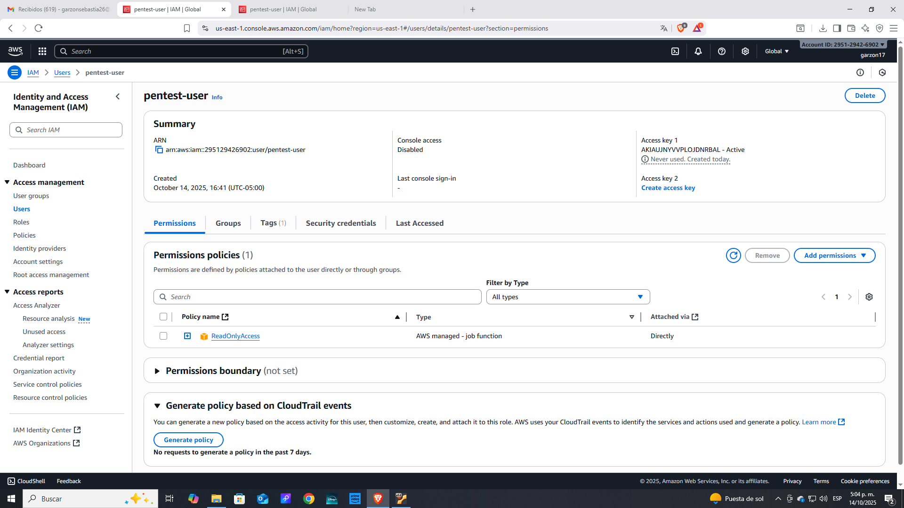
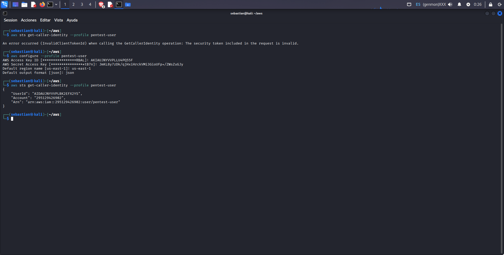
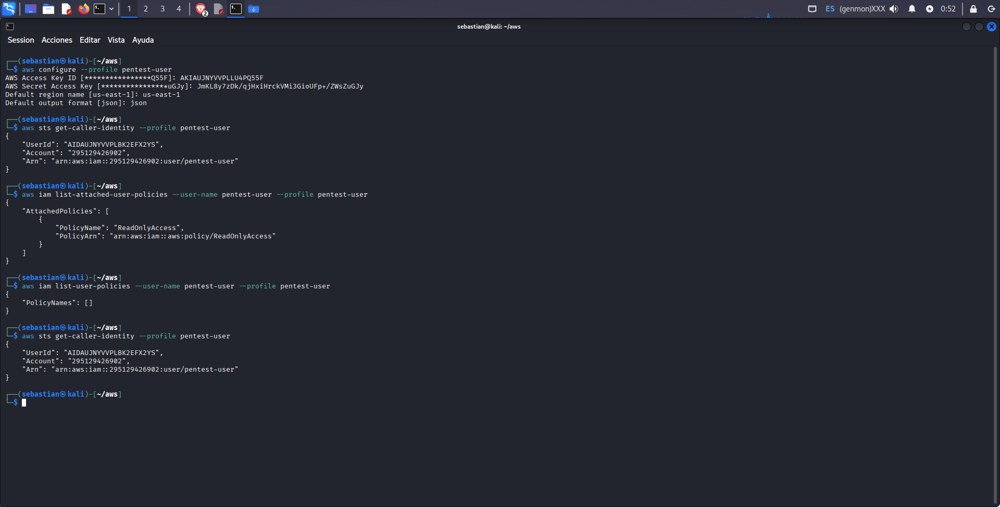
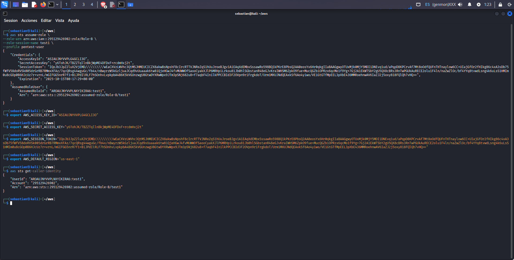
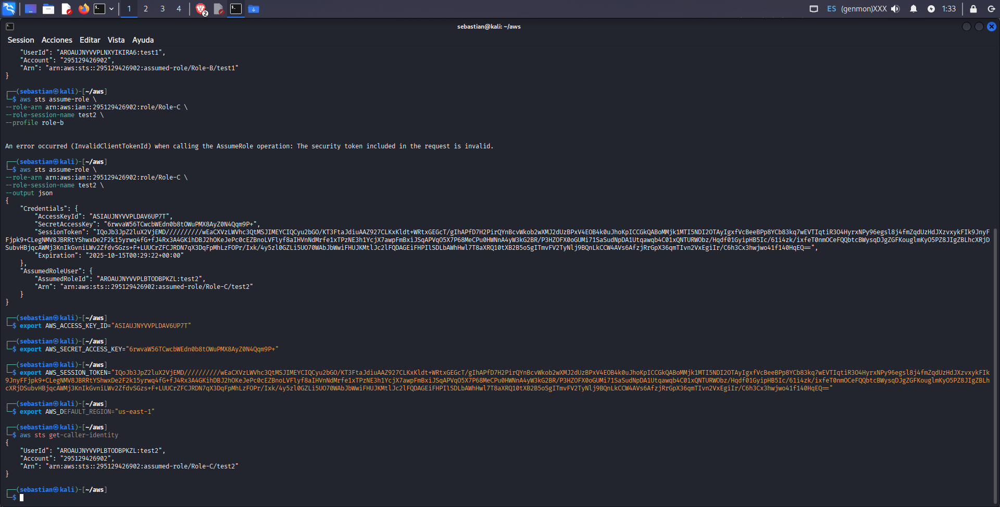
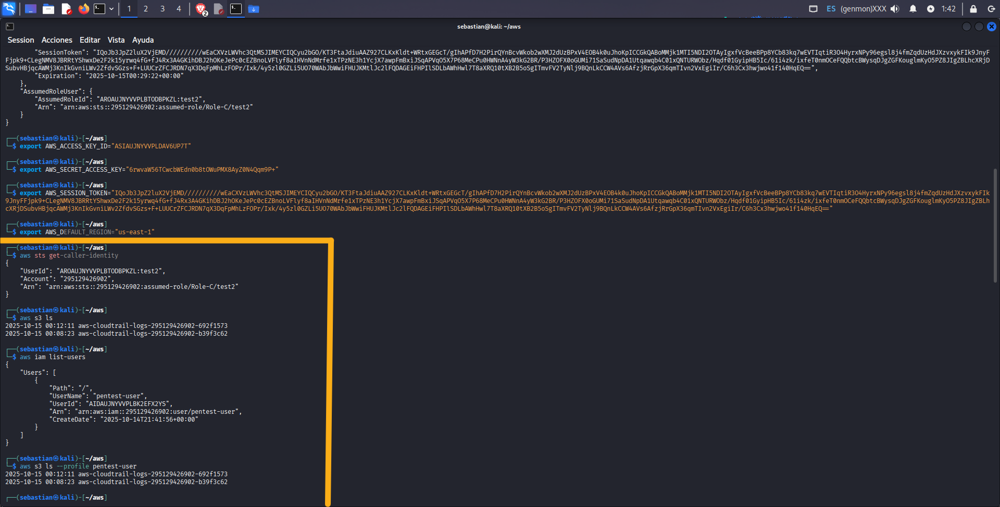
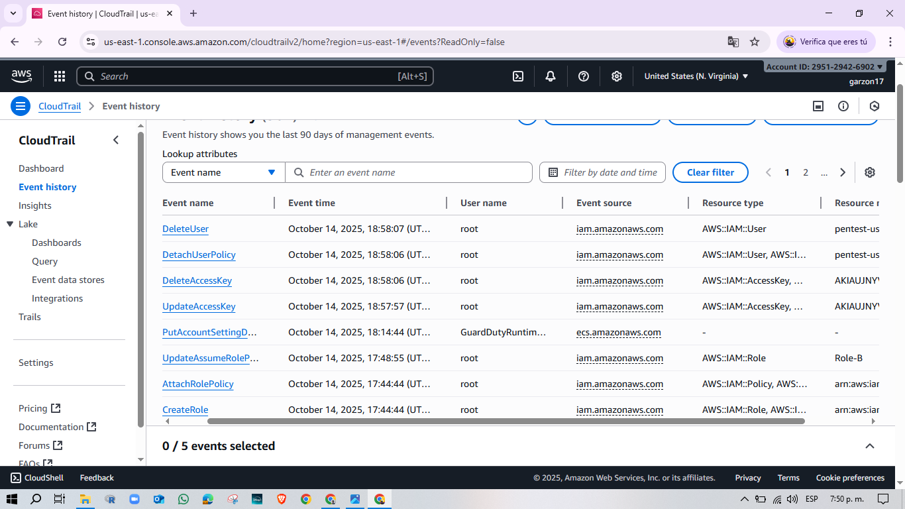
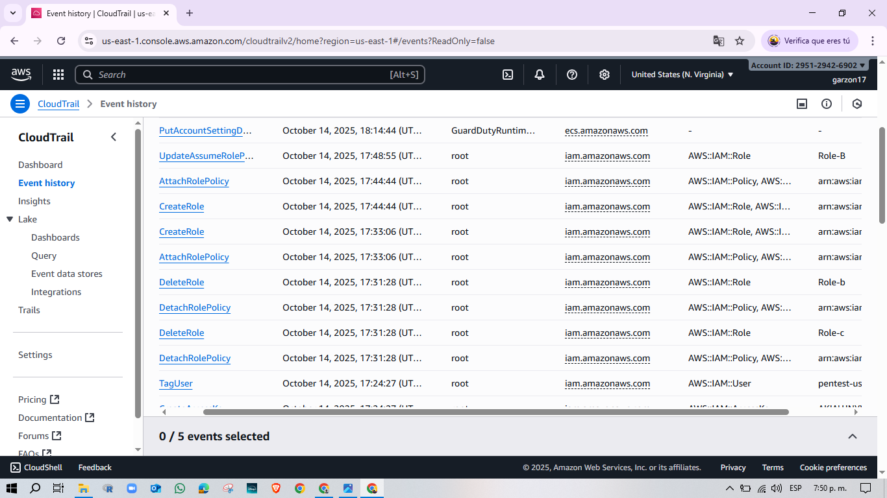
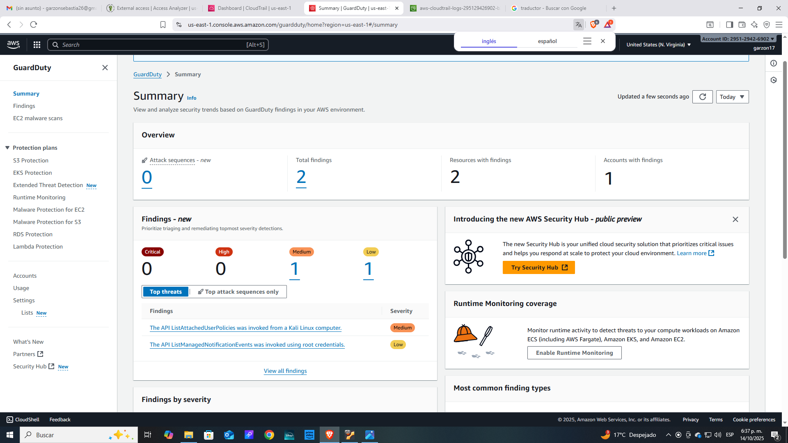

# AWS IAM & Cloud Security 
Este laboratorio demuestra el uso de **AWS IAM, CloudTrail y GuardDuty** para simular actividades de seguridad y monitoreo en la nube. El objetivo fue crear un escenario controlado donde un usuario con permisos limitados interactua con la infraestructura, generando eventos que pueden ser analizados para fines de audotoria, respuesta a incidentes y hardening de seguridad.

Este laboratorio simula un escenario de pruebas de seguridad en AWS, demostrando:
 
 - Creacion de usuarios y roles con permisos limitados.
 - Esacalamiento de privilegios mediante **IAM Role Chaining**.
 - Monitoreo y deteccion de actividades sospechosas con **CloudTrail**, **GuardDuty**.
 - Ejecucion de ataques de enumeracion desde **Kali linux**.
 ---
 ## Arquitectura del laboratorio
 - **Usuario inicial:** "pentest-user" con politicas "ReadOnlyAccess".
 - **Roles configurados:** "Role-B" y "Role-C".  
 - **Servicios habilitados:**
 - CloudTrail (multi-region trail)
 - GuardDuty (deteccion de anomalias)

 
---
## Escalada paso a paso 

Confirmamos y configuramos nuestro perfil desde kali obteniendo debidamente nuestras claves de ususario y confirmamos nuestro perfil.
 
 

 

 Lo siguiente es acceder a los roles que estamos permitidos con estos comandos: 
 ```bash 
 aws sts assume-role \
  --role-arn arn:aws:iam::295129426902:role/Role-B \
  --role-session-name test1 \
  --profile pentest-user

# Se exportan las credencialess que arrroja el anterior comado
export AWS_ACCESS_KEY_ID="ASIA..."
export AWS_SECRET_ACCESS_KEY="..."
export AWS_SESSION_TOKEN="..."
export AWS_DEFAULT_REGION="us-east-1"

aws sts get-caller-identity
```


Vemos que oficialmente hemos asumido el Rol-B con su politica **AmazonS3FullAccess** lo siguiente es que vamos hacer en cadena con el Rol-C.

```bash
aws sts assume-role \
  --role-arn arn:aws:iam::295129426902:role/Role-C \
  --role-session-name test2

export AWS_ACCESS_KEY_ID="ASIA..."
export AWS_SECRET_ACCESS_KEY="..."
export AWS_SESSION_TOKEN="..."

aws sts get-caller-identity
```

 
 Y Accedemos al Rol-C con su politica de permisos  mas impotartante la cual es **AdministratorAccess.**

Despues de eso podemos realizar una lista de usuarios, perfiles y recursos.


---

## Evidencias de Deteccion 
- **cloudTrail:** registra cada accion AssumeRole, cambios en politicas IAM, creacion y eliminacion de usuarios.






- **GuardDuty:** genera hallazgos por comportamiento sospechoso (uso de root, acceso desde kali).



---

## Riesgo
Un atacante con credenciales de bajo privilegio puede escalar hasta administrador si existen trust policies mal configuradas. Esto habilita acceso compleo a datos (S3), usuarios (IAM), y otros servicios criticos.

## Mitigaciones 
- Aplicar **principio de menor privilegio** en roles y politicas. 
- **Restringir trust policies** (ARNs especificos, condiciones de MFA).
- Monitorear **CloudTrial** y activar alertas **GuardDuty.**
- Usar **Access Analyzer** para identificar accesos no deseados.

La practica de estos recursos refuerza la importancia de la visibilidad y el monitoreo continuo en AWS como medidas de seguridad fundamentales.
