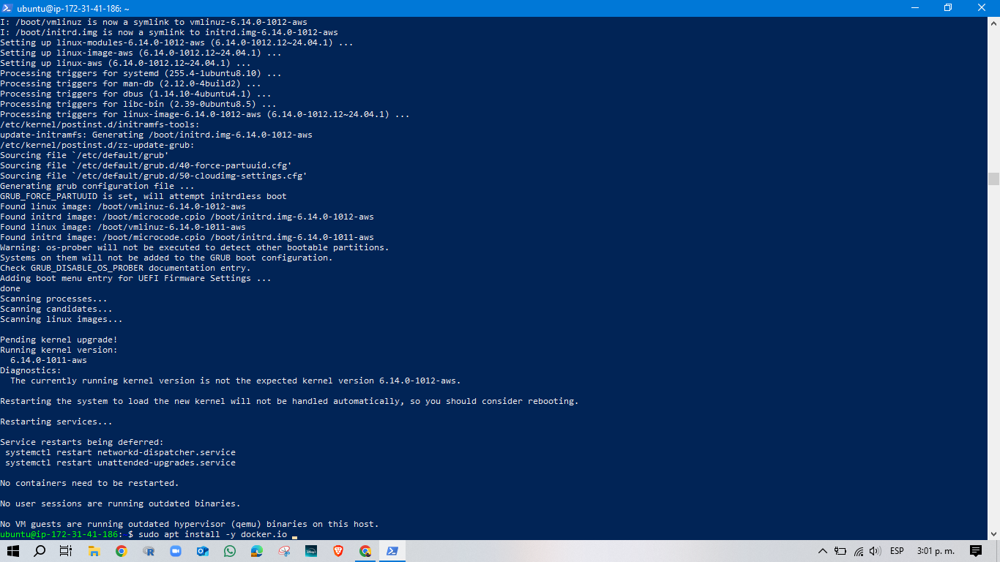
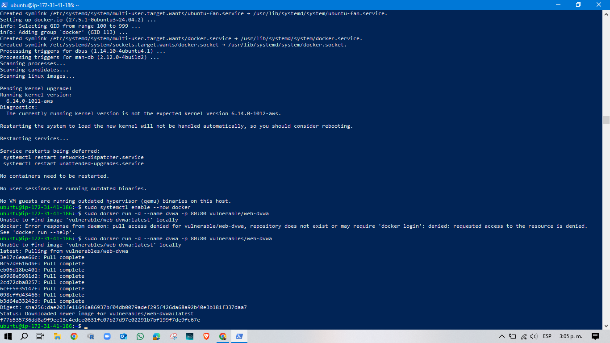
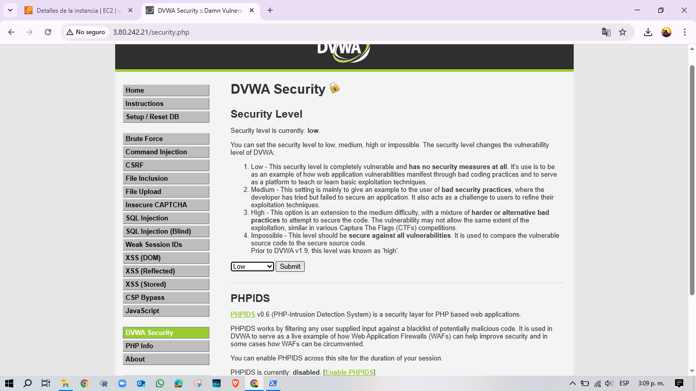

# Caza Vulnerabilidades en la Nube (AWS +DVWA)
## Introduccion 
Este proyecto consiste en montar un entorno vulnerable en la nube (AWS EC2 + DVWA) y realizar un **proceso de pentesting completo** documentando las fases de:

1. Reconocimiento
2. Escaneo y enumeracion 
3. Explotacion 
4. Documentacion de hallazgos

El objetivo es demostrar habilidades practicas **Cloud security y Hacking Etico** simulando lo que haria un consultor en un test de penetracion real.

## Configuracion del Entorno
- **Provedor Cloud**: AWS
- **Instancia**: EC2 t3.micro-Ubuntu 24.04 LTS
- **Aplicacion Vulnerable**: DVWA-Damn Vulnerable Web Application en Docker
- **Security Groups configurados**: 
- 22/tcp (SSH) abierto a 0.0.0.0/0
- 80/tcp (HTTP) abierto a 0.0.0.0/0
- 3306/tcp (MySQL) abierto a 0.0.0.0/0


  

## 2. Acceso remoto por SSH 
Conectamos desde PowerShell en windows con la clave .pem descargada.

```bash
ssh -i C:\User\Administrador\Downloads\PTrf1.pem ubuntu@3.80.242.21 
```

  
## 3. Instalacion de dependencias
Acualizamos el sistema en instalamos Docker para desplegar aplicaciones vulnerables.
```bash
sudo apt update && sudo apt upgrade -y 
sudo apt install -y docker.io 
sudo systemctl enable --now docker
```



## 4. Ejecucion de DVWA (Damn Vulnerable Web App)
Corremos DVWA en la instancia
```bash
sudo docker run -d --name dvwa -p 80:80 vulnerables/web-dvwa
```


## Configuracion de DVWA 
- Accedemos desde el navegador: http://3.80.242.21
- Configuramos la base de datos.
- Ajustamos la seguridad a LOW pra facilitar las pruebas.





## Fase 1 - Reconocimiento 
 
 - **Ping** 

 Se probo conctividad ICPM, pero fue filtrado (100% packet loss). Esto indica presencia de un firewall que bloquea ICMP.
  

 - **Escaneo con Nmap**
 
 
  
  **Resultados principales** 
- Puerto 22/tcp abierto = OpenSSH 9.6p1 (Ubuntu)
- Puerto 80/tcp abierto = Apache httpd 2.4.25 (Debian)

## Fase 2 - Enumeracion

Se utilizo **Gobuster** para descubrir directorios en el servidor web: 


**Resultados**
 - /login.php
 - /config/
 - /docs/ 
 - /phpinfo.php
 
 ## Fase 3 - Explotacion 

 - **Manipulacion de Cookies**

A de las DevTools del navegador se identifico la cookie **security=low**, lo que confirma que el nivel de seguridad podia ser manipulado por el usuario.


- **SQL Injection con slqmap**

Se probo uan inyeccion SQL en el parametro id de la aplicacion vulnerable:


 
 **Resultado**: sqlmap detecto intentos de inyeccion, pero algunos parametros parecian protegidos o no explotables en ese momento.

 ## Hallazgos
 1. **Puertos abiertos expuestos a internet**: SSH y HTTP = Riesgo alto si no se restringen.

 2. **Directorios sensibles detectados**: /config/,/phpinfo.php = Fuga de informacion.

 3. **Aplicacion Vulnerable (DVWA)**: Nivel de seguridad bajo intencionalmete para pruebas.

 4. **SQL Injection probada con Sqlmap**: La aplicacion es vulnearble, aunque el exploit no devolvio datos completos.

 ## **Lecciones Aprendidas**

 - La importancia de documentar paso a paso cada hallazgo.
 - Como configurar y conectar instancias en AWS con llaves .pem.
 - Uso practico de herramientas: **Nmap**, **Gobuster**, **Sqlmap**, **DevTools**.
 - Buenas practicas de seguridad en la nube (Ejemplo:no abrir puertos a todo el mundo)

