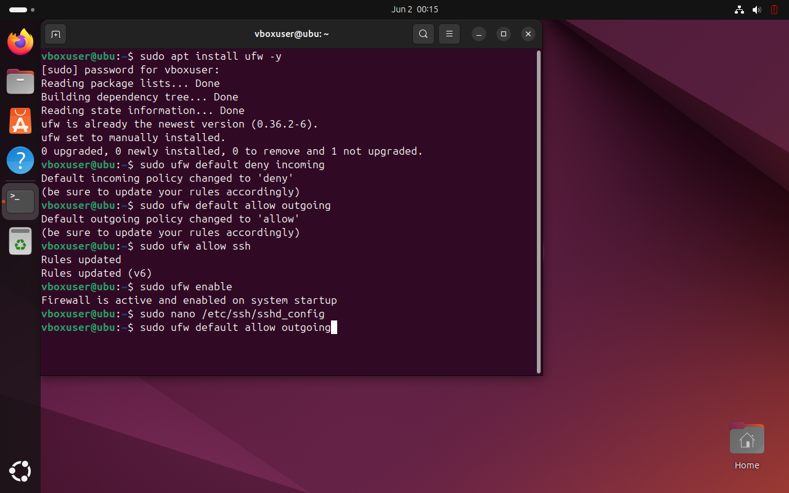
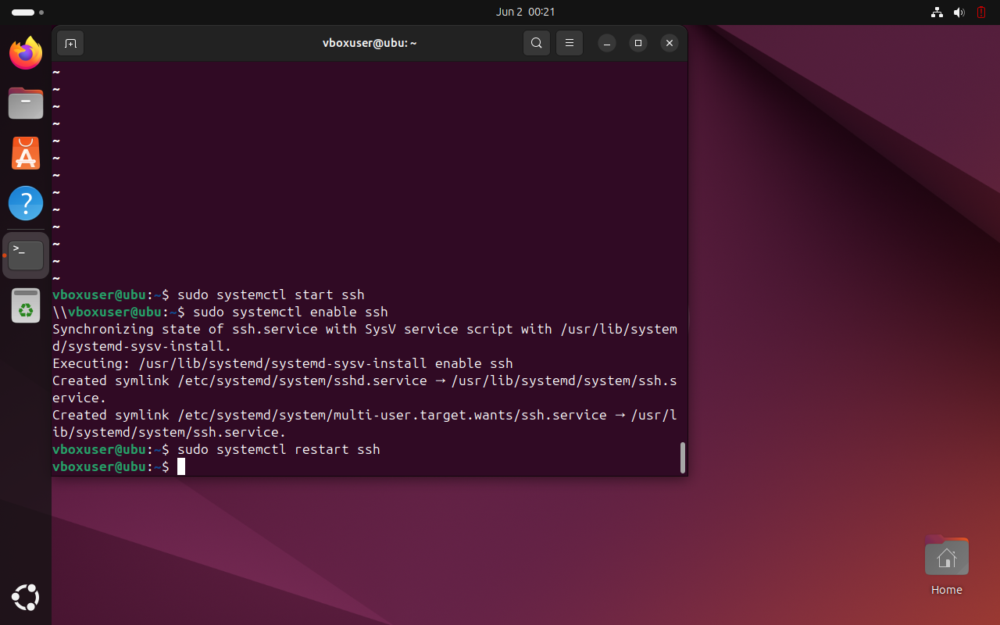
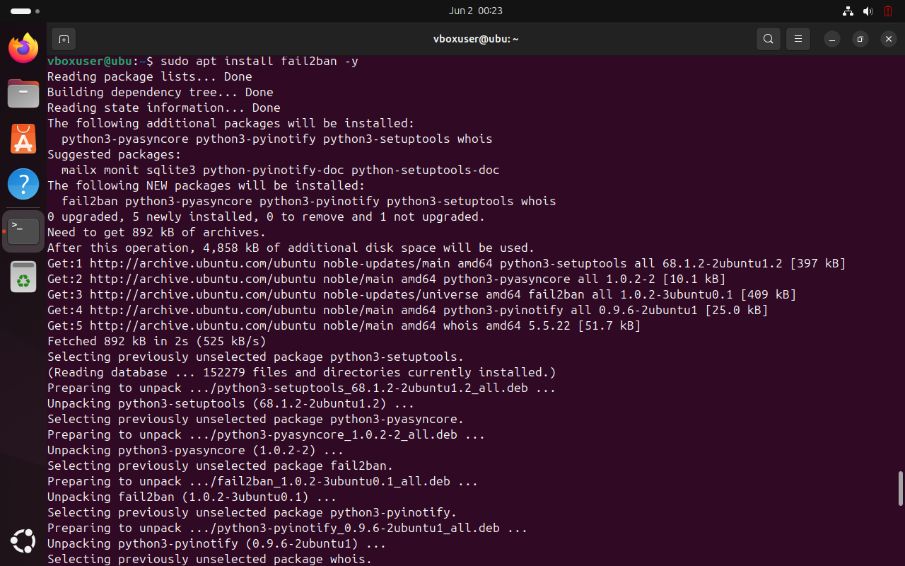
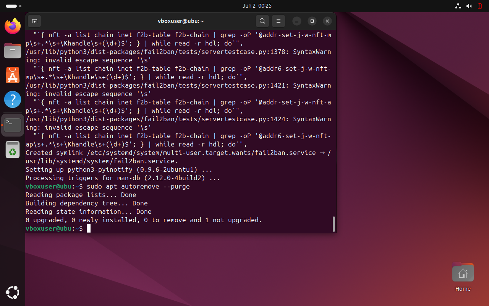

# Linux Hardening - Ubuntu

Este proyecto muestra como aplicar buenas practicas de hardening a un sistema Ubuntu Linux.

## Objetivo
Reducir la superficie de ataque y fortalecer la seguridad del sistema.

## Tecnicas aplicadas 
- **Actualizacion del sistema.**

sudo apt update && sudo apt upgrade -y

- **UFW (firewall)**
```bash
sudo apt install ufw -y 
sudo ufw default deny incoming
sudo ufw default allow outgoing
sudo ufw allow ssh 
sudo ufw enable 
 ```
Esto bloquea todo el trafico entrante excepto SSH



- **Configuracion segura de SSH**
```bash 
sudo nano /etc/ssh/sshd_config

se agregan estas lineas

permitrootlogin no
passwordauthentication no
permitemptypasswords no
x11forwarding no

Reinicia el servicio 

sudi systemctl restart ssh
```

SSH mas seguro

- **Instalacion de Fail2Ban**
```bash
sudo apt install fail2ban -y
```
Protege contra ataques de fuerza bruta en servicios como SSH.


- **Eliminacion de paquetes innecesarios** 
```bash
sudo apt autoremove --purge
```


- **Escaneo de seguridad con Lynis**
```bash
sudo apt install lynis -y
sudo lynis audit system
```

Te da recomendaciones de seguridad

## Herramientas utilizadas
- UFW
- SSH
- Fail2Ban 
- Lynis

Aplicar hardening a sistemas linux es una practica esencial para cualquier administrador de sistemas, profesional de ciberseguridas o entusiasta de Blue Team. Este proyecto demuestra conocimientos practicos sobre como:

- **Reducir la superficie de ataque**, cerrando servicios innecesarios y aplicando politicas restrictivas.
- **Prevenir accesos no autorizados**, reforzando configuraciones como SSH y usando herramientas UFW y Fail2Ban.
- **Detectar vulnerabilidades** con herramientas de analisis como lynis.

Este tipo de configuraciones **simulan entornos reales** y ayudan a prepararse para escenarios del mundo profesional en seguridad ofensiva y defensiva, especialmente en entornos Cloud y DevSecOps.
