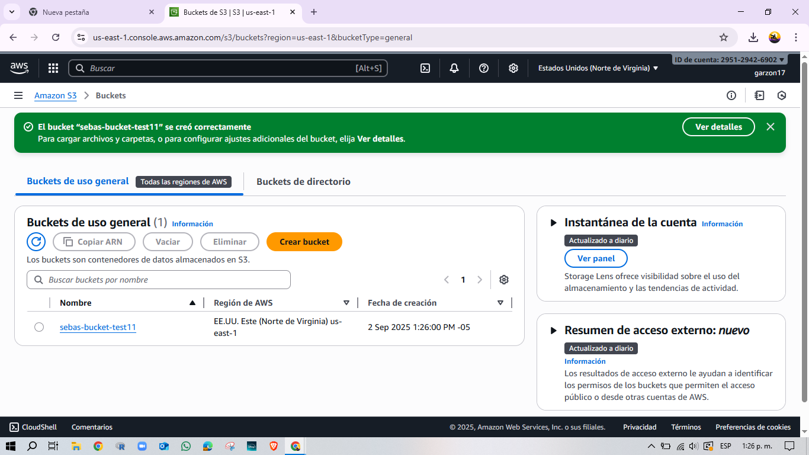
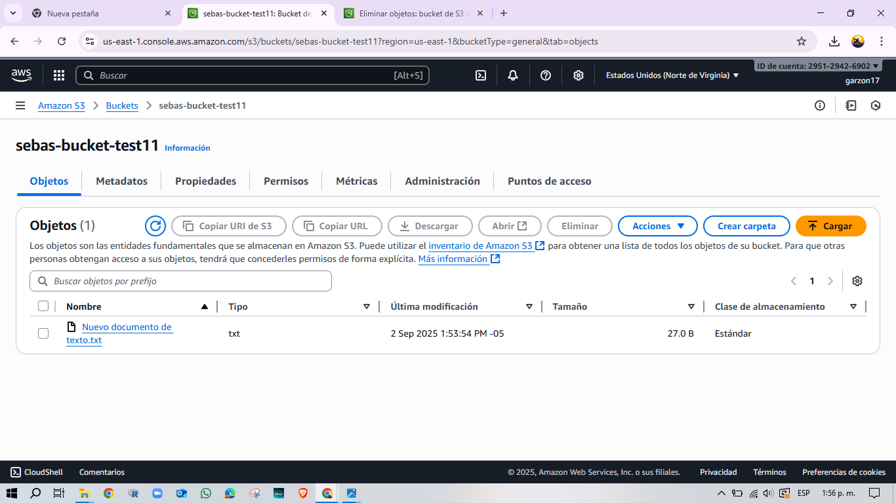
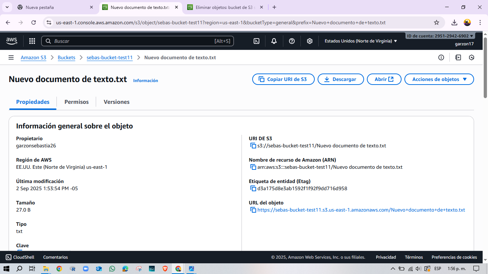
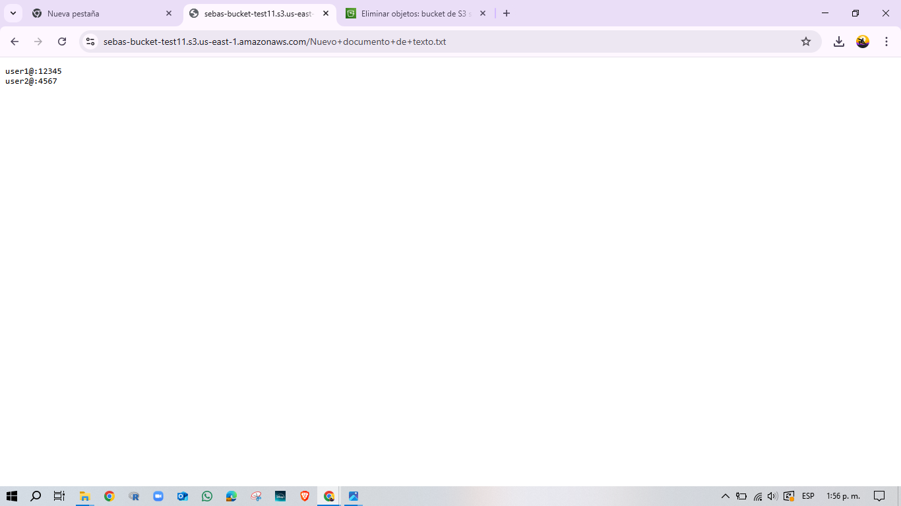
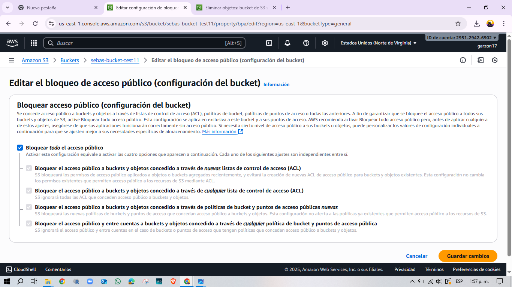
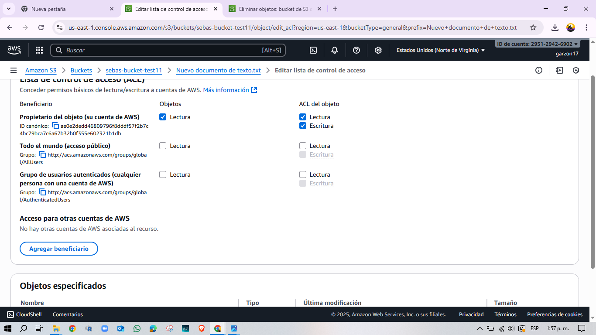
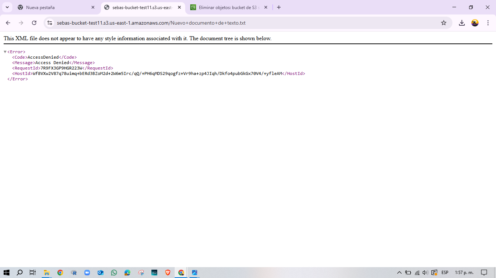

# Proyecto 01 - Cloud Pentesting: AWS S3 Bucket Inseguro
## Objetivo
Simular una mala configuracion en AWS S3 para demostrar como un archivo sensible puede ser expuesto publicamente y luego asegurar el recurso con buenas practicas.
## Herramientas Uilizdas
- AWS S3
- Navegador web
- Archivo (txt)
## Pasos Realizados
1. Cree un bucket en AWS S3 (sebas-bucket-test11).

2. Subi un archivo txt con usuarios ficticios.

3. Desactive **Block Public Access** y configure la ACL para permitir la lectura Publica.

4. Verifique que el archivo era accesible mediante URL sin credenciales. 

5. Aplique correccion: active **Block Public Acces** y elimine permisos publicos.

6. Volvi a probar la URL y obtuve **AccessDenied**.

**Acceso denegado despues del un intento con sus respectivos cambios de seguridad y acceso**.

## Riesgos  
Un bucket S3 publico permite que cualquier persona con URL acceda a informacion sensible. 
Este error aunque sea muy basico ha causado incidentes de seguridad en empresas reales.

## Correcion aplicada 
- Activar **block Public Access** en todos los buckets.
- Usar **Politicas IAM** para controlar el acceso.
- Revisar periodicamente configuraciones en bucket.
