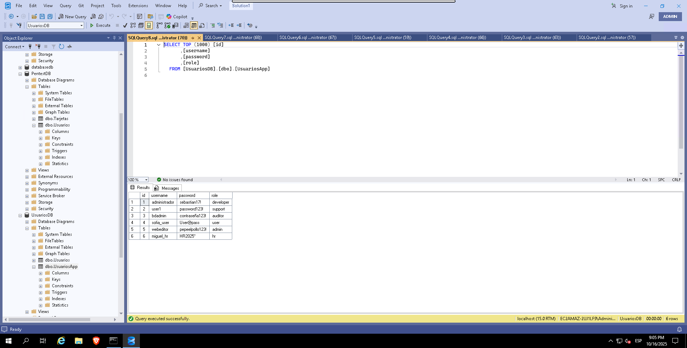

# Red Team Emulation - MITRE ATT&CK Chain

## Descripcion 
Este proyecto documenta la **emulacion de un ataque Red Team** sobre un entorno controlado en la nube AWS (Windows Server 2019 + SQL Server 2019).

El objetivo fue simular el ciclo completo de un ataque siguiendo la matriz **MITRE ATT&CK**, desde el acceso inicial hasta la exfiltracion y persistencia.

Se presentan fases, tecnicas usadas y evidencias visuales.

---

## Tecnologias y Herramientas
- **Kali linux** : nmap, SMBClient, Gobuster, Hashcat, Impacket.
- **Windows Server 2019** con Microsoft SQL Server 2019.
- **Powershell** para post-explotacion.
- **Remmina (RPD)** para acceso remoto.
- **Hashes.com** (cracking de hash online)

## Mapeo MITRE ATT&CK (Tácticas y Técnicas)

| Fase | Acción | Técnica | MITRE ID |
|------|--------|---------|----------|
| **Acceso inicial** | Acceso remoto vía SMB expuesto | External Remote Services | `T1133` |
| **Descubrimiento** | Exploración de archivos y carpetas compartidas (C$, Program Files, MSSQL) | File and Directory Discovery | `T1083` |
| **Obtención de credenciales** | Hash extraído desde archivo `secret.txt` | OS Credential Dumping: SAM | `T1005` |
| **Cracking offline** | Descifrado de hash SHA256 con Hashcat / Hashes.com | Brute Force: Password Cracking | `T1110.002` |
| **Acceso remoto admin** | Conexión SMB con credenciales de Administrator | Remote Services: SMB Admin Shares | `T1021.002` |
| **Acceso a base de datos** | Acceso a SQL Server y extracción de tablas (Usuarios, Tarjetas) | Data from information Repositories:Databases | `T1213.003`  |
| **Exfiltración** | Exportación de registros sensibles desde SQL | Exfiltration over C2 Channel | `T1041` |
| **Persistencia** | Creación de usuario backdoor admin con PowerShell | Create Account: Local Account | `T1136.001` |
| **Ejecución** | Uso de PowerShell para ejecutar comandos de persistencia | Command and Scripting Interpreter: PowerShell | `T1059.001` |

---

## Fases del ataque
 ### 1 Reconocimiento y Acceso Inicial 
 - Se identificaron puertos abiertos con nmap: **80 (HTTP), 445 (SMB), 1433 (MSSQL), 3389 (RPD**).
 - Acceso inicial via SMB con credenciales de bajo privilegio (user1).
 - Enumeramos y obtenemos listado del user1

 

 

 

 
   
Inicio de SMB: 

---

### 2 Descubrimiento 
Iniciamos acceso remoto con **Remmina** y obtenemos un hash.

---

### 3 Obtencion de credenciales y cracking
- El hash nos arroja una contraseña **Sebastian17!** La cual usaremos para acceder como administrador del servidor.

---

### 4 Escalada a Administrador
- Establecemos conexion con SMB como **Administrator** usando la contraseña crackeada **Sebastian17!**.
- Acceso completo a todos los discos.

---

### 5 Acceso a Base de Datos
- Ingreso a SQL Server (PentestDB, UsuariosDB)
- Extracion de tablas con usuarios nombres tarjetas contraseñas y correos.

---

### 6 Persistencia
- Creacion de usuario bacdoor administrator via powershell:

---

## Conclusiones
- Se logro comprometer un servidor Windows en la nube mediante **servicios expuestos y credenciales inseguras**.
- Se accedio a bases de datos con informacion sensible (usuarios y tarjetas).
- Se establecio **Persistencia** mediante la creacion de un usuario administrador alternativo.

---
## Recomendaciones
- No exponer servicios sensibles (SMB, SQL, RPD) a internet.
- Usar contraseñas robustas y rotacion periodica.
- Implementar segmentacion de red y firewall restrictivo.
-Monitorear accesos anomalos y creacion de cuentas administrativas.
