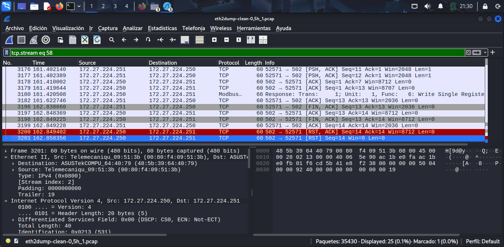

# Analisis de tarfico con Wireshark 
## Archivo analizado 
- eth2dump-clean_05h_1.pcap

## Objetivo
Realizar un analisis basico de trafico con wiresharkpara identificar protocolos, conexiones y eventos sospechosos o importantes en una red.
---

## Analisis 
Durante la revision de archivo ".pcap" se observaron multiples paquetes TCP, Modbus y protocolos relacionados 

### Ejemplo relevante: paquete TCP con bandera RST 
-**Protocolo:** TCP

-**Direccion ip origen:** 172.27.224.250

-**Direccion ip destino:** 172.27.224.251

-**Flag activa:** RST (reset)

**Intrepretacion:**
- El paquete indica que fue terminado abruptamente.
- Puede deberse a una denegacion de conexion o escaneo de puertos.
- Se podria asociar a actividad sospechosa o mecanismos de defensa.

---

## Lecciones aprendidas 
- Uso basico de wireshark.
- Identificacion de protocolos TCP/Modbus.
- Interpretacion de flags TCP como SYN, ACK Y RST.
- Deteccion visual de patrones anomalos.

---

## Herramientas usadas 
- Wireshark
- Sistema: kali linux (virtualbox)
